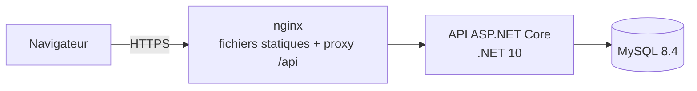

# SIRH — Paie, personnel et talents avec IA

Application web de gestion de la paie, de l'administration du personnel et du management des talents
(contexte tunisien), avec IA générative, détection d'anomalies (ML) et agents IA à venir dans les prochaines étapes.

**Stack (100 % gratuite / open source)** : .NET 10 · Angular 21 + PrimeNG · MySQL 8.4 · Docker.

## Démarrage

docker compose up -d --build


| Service | Adresse | Rôle |
|---|---|---|
| Interface web | http://localhost:8080 | Angular, servi par nginx |
| API | appelée par l'interface via `/api/...` | ASP.NET Core |
| Adminer | http://localhost:8081 | consulter MySQL (serveur : `mysql`, voir identifiants dans `.env`) |
| MySQL | 127.0.0.1:3306 | accessible uniquement depuis ta machine |

Le fichier `.env` fourni contient déjà des secrets générés aléatoirement : le projet démarre sans rien
configurer. Avant tout usage avec de vraies données, régénère ces secrets .

## Structure

```
sirh/
├─ backend/                 solution .NET
│  └─ src/   Sirh.Api · Sirh.Application · Sirh.Domain · Sirh.Infrastructure · Sirh.Payroll.Engine
│  └─ tests/ Sirh.Payroll.Tests
├─ web/                     Angular + PrimeNG (template Sakai personnalisé, voir web/README.md)
├─ docker/mysql/init/       création des comptes MySQL (moindre privilège)
├─ docker-compose.yml
├─ .env                     secrets locaux prêts à l'emploi (jamais versionné)
          
```

## Architecture


Monolithe modulaire (Clean Architecture) plutôt que microservices .

**Conventions de données**, à respecter dès le premier module métier :
- Montants en `DECIMAL(18,3)` (le dinar tunisien se divise en 1 000 millimes).
- Dates en UTC en base (voir `--default-time-zone=+00:00` dans `docker-compose.yml`), converties à l'affichage.
- Multi-sociétés : colonne `TenantId` sur chaque table métier (voir `Sirh.Domain.Common.IHasTenant`).
- Référentiels réglementaires (taux, barèmes) : données datées avec leur source, jamais du code en dur.

## Sécurité — ce qui est déjà en place

| Mesure | Où |
|---|---|
| Deux comptes MySQL distincts : `migrator` (schéma) et `app` (données, sans DDL) | `docker/mysql/init/01-users.sh` |
| MySQL et Adminer exposés uniquement sur `127.0.0.1` | `docker-compose.yml` |
| Conteneurs applicatifs sans privilèges (`no-new-privileges`, `cap_drop: ALL`, utilisateur non-root) | `docker-compose.yml`, Dockerfiles |
| En-têtes de sécurité et CSP stricte (aucun script inline) | `web/security-headers.conf` |
| Réseaux Docker séparés : `frontend` (web ↔ API) et `backend` (API ↔ base) | `docker-compose.yml` |
| Ressources auto-hébergées (police Inter incluse, aucune requête vers un tiers) | `web/` |

