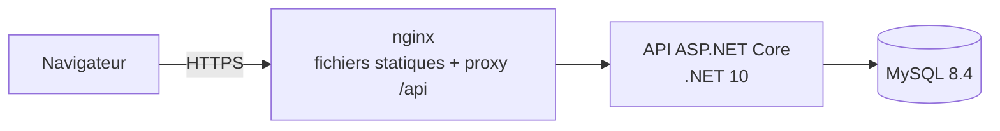

# RHSystem — Paie, personnel et talents avec IA

Application web de gestion de la paie, de l'administration du personnel et du management des talents
(contexte tunisien), avec IA générative, détection d'anomalies (ML) et agents IA à venir dans les prochaines étapes.

**Stack : .NET 10 · Angular 21 + PrimeNG · MySQL 8.4 · Docker.

## Démarrage

docker compose up -d --build


| Service | Adresse | Rôle |
|---|---|---|
| Interface web | http://localhost:8080 | Angular, servi par nginx |
| API | appelée par l'interface via `/api/...` | ASP.NET Core |
| Adminer | http://localhost:8081 | consulter MySQL (serveur : `mysql`, voir identifiants dans `.env`) |
| MySQL | 127.0.0.1:3306 | accessible uniquement depuis ta machine |

Le fichier `.env` fourni contient déjà des secrets générés aléatoirement : le projet démarre sans rien
configurer. Avant tout usage avec de vraies données, régénère ces secrets .

## Structure

```
sirh/
├─ backend/                 solution .NET
│  └─ src/   Sirh.Api · Sirh.Application · Sirh.Domain · Sirh.Infrastructure · Sirh.Payroll.Engine
│  └─ tests/ Sirh.Payroll.Tests
├─ web/                     Angular + PrimeNG (template Sakai personnalisé, voir web/README.md)
├─ docker/mysql/init/       création des comptes MySQL (moindre privilège)
├─ docker-compose.yml
├─ .env                     secrets locaux prêts à l'emploi 
          
```

## Architecture


Monolithe modulaire (Clean Architecture) plutôt que microservices .

