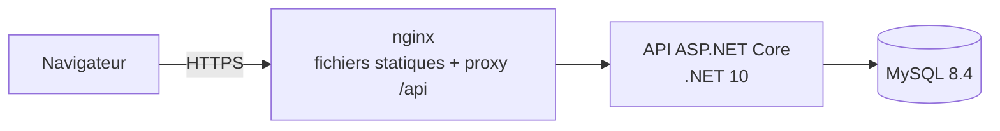

# RHSystem — CNSS, personnel et talents avec IA

Application web de gestion de la Cnss, de l'administration du personnel et du management des talents avec IA générative, détection d'anomalies (ML) et agents IA.

**Stack : .NET 10 · Angular 21 + PrimeNG · MySQL 8.4 · Docker.

## Démarrage

docker compose up -d --build


Le fichier `.env` fourni contient déjà des secrets générés aléatoirement : le projet démarre sans rien
configurer. Avant tout usage avec de vraies données, régénère ces secrets .

## Structure

```
sirh/
├─ backend/                 solution .NET
│  └─ src/   Sirh.Api · Sirh.Application · Sirh.Domain · Sirh.Infrastructure · Sirh.Payroll.Engine
│  └─ tests/ Sirh.Payroll.Tests
├─ web/                     Angular + PrimeNG (template Sakai personnalisé
├─ docker/mysql/init/       création des comptes MySQL (moindre privilège)
├─ docker-compose.yml
├─ .env                     secrets locaux 
          
```

## Architecture


Monolithe modulaire (Clean Architecture) plutôt que microservices .

