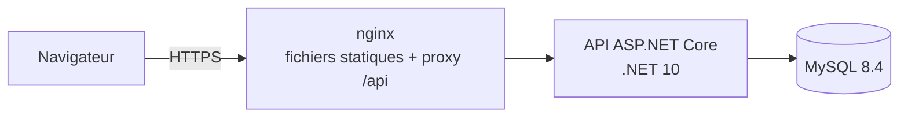

# SIRH — Paie, personnel et talents avec IA

Application web de gestion de la paie, de l'administration du personnel et du management des talents, avec IA générative, détection d'anomalies (ML) et agents IA .

**Stack (100 % gratuite / open source)** : .NET 10 · Angular 21 + PrimeNG · MySQL 8.4 · Docker.

## Démarrage

```bash
docker compose up -d --build
```

| Service | Adresse | Rôle |
|---|---|---|
| Interface web | http://localhost:8080 | Angular, servi par nginx |
| API | appelée par l'interface via `/api/...` | ASP.NET Core |
| Adminer | http://localhost:8081 | consulter MySQL (serveur : `mysql`, voir identifiants dans `.env`) |
| MySQL | 127.0.0.1:3307 | accessible uniquement depuis ta machine |


Pour arrêter : `docker compose down` (ajoute `-v` pour aussi supprimer les données MySQL).

## Structure

```
sirh/
├─ backend/                 solution .NET
│  └─ src/   Sirh.Api · Sirh.Application · Sirh.Domain · Sirh.Infrastructure · Sirh.Payroll.Engine
│  └─ tests/ Sirh.Payroll.Tests
├─ web/                     Angular + PrimeNG (template Sakai personnalisé, voir web/README.md)
├─ docker/mysql/init/       création des comptes MySQL (moindre privilège)
├─ docker-compose.yml
├─ .env                     secrets locaux prêts à l'emploi versionné

```

## Se connecter à l'API

Au premier démarrage, un compte administrateur est créé automatiquement à partir de `.env`
(`ADMIN_EMAIL` / `ADMIN_PASSWORD`).

## Architecture


```mermaid
flowchart LR
  U[Navigateur] -->|HTTPS| N[nginx<br/>fichiers statiques + proxy /api]
  N --> API[API ASP.NET Core<br/>.NET 10]
  API --> DB[(MySQL 8.4)]
```

Monolithe modulaire (Clean Architecture) plutôt que microservices :la paie exige de la cohérence transactionnelle.

**Conventions de données**, déjà appliquées :
- Montants en `DECIMAL(18,3)` (le dinar tunisien se divise en 1 000 millimes).
- Dates en UTC en base , converties à l'affichage.
- Multi-sociétés :chaque requête ne voit que les données de la société de l'utilisateur courant.
- Référentiels réglementaires (taux, barèmes) : données datées avec leur source.


